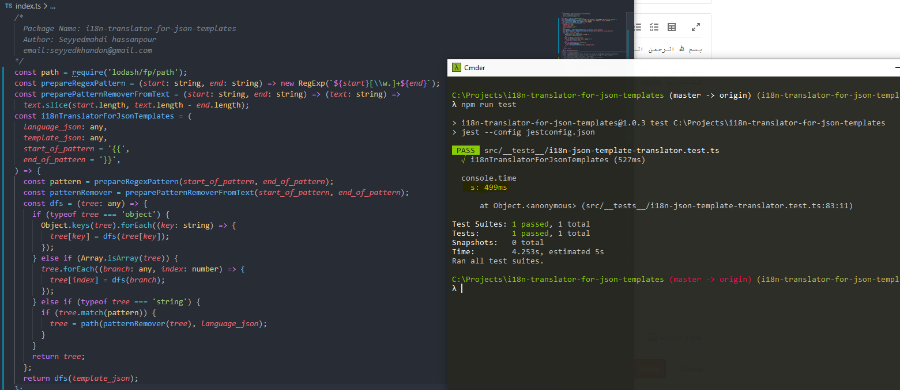
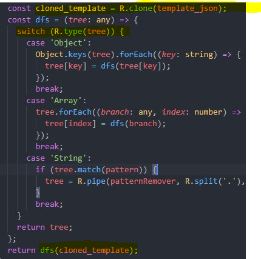
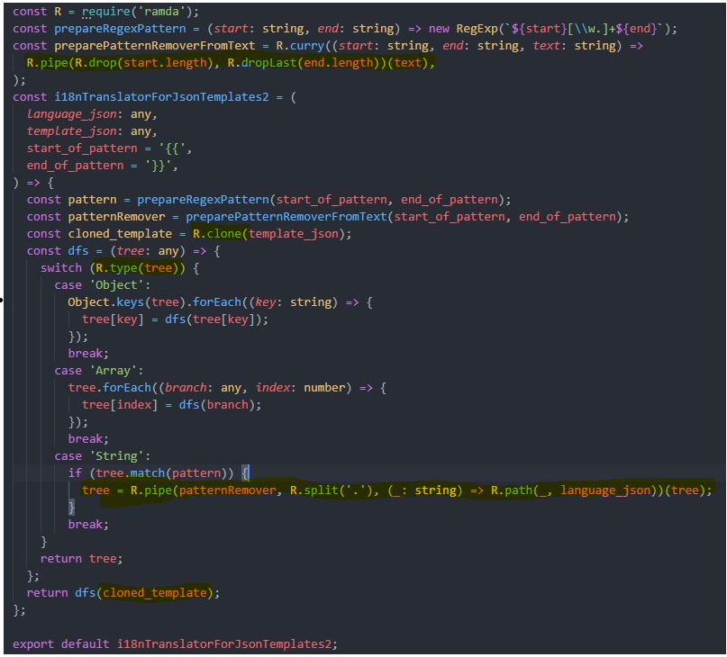
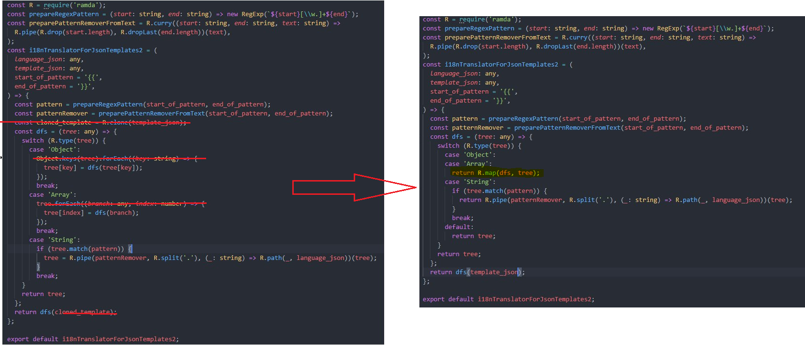
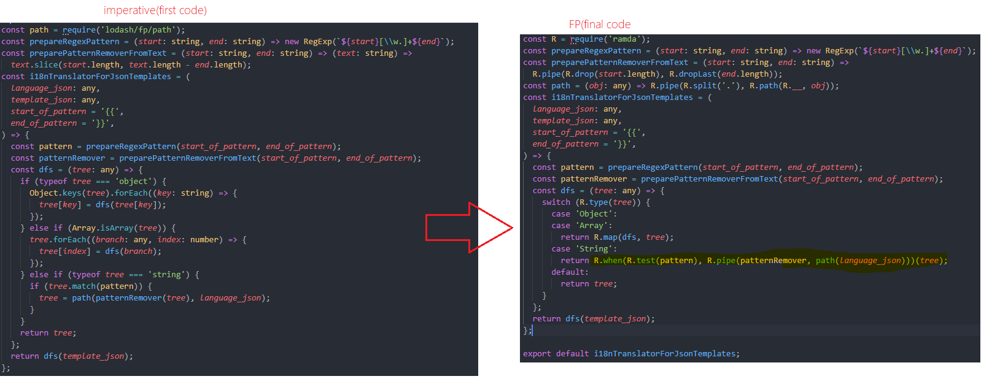
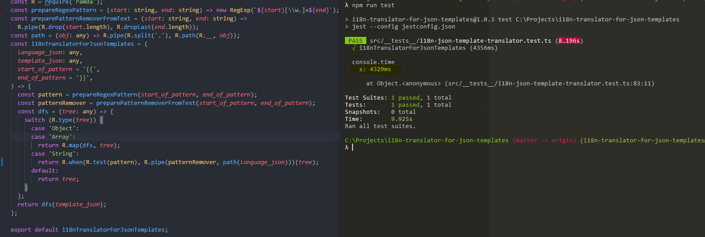

<div dir="auto" align="right">
	
بسم الله الرحمن الرحیم 

مقدمه:

خب میخواهیم که به عنوان یک تمرین گام به گام سعی کنیم کد زیر رو که به صورت imperative هست رو به یک نسخه fp با کمک کتابخونه Ramda تبدیل کنیم. کد زیر ب خودی خود خوانایی مناسبی داره اما قراره که ما خوانایی اونو بیشتر و بیشترش کنیم تا مدیریتش بهتر و ساده تر بشه، همچنین باید توجه کنیم که فانکشنمون باید immutable باشه یعنی اینکه فقط توسط  خروجی اش بر محیط بیرون تاثیر بزاره، که این فانکشن همونطور که میبنین روی objectی که بهش پاس داده میشه عمل میکنه و اونا رو تغییر میده.(تو ادامه میشد که از خود lodash fp هم استفاده کرد اما بشخصه احساس کردم رامدا داکیومنت مناسب تری برای اینکار داره و راحتتر میتونستم درک کنم و مطالعه کنم و کد بزنم باهاش برای همین از رامدا استفاده میکنم، هرچند که لودش از لحاظ سرعت ظاهرا قوی ترعمل میکنه).


اول از همه یه توضیح درمورد این برنامه بدم که چی هست تا درک بهتری پیدا کنید برای باقی مطلب، این کتابخونه کارششبیه i18n هست، شما تو i18 تو تمپیتتون برای ترجمه از یک عبارت خاص استفاده میکنین مثلا

 t("dashboard.statistics.cell.type")

تا بتونین به راحتی عمل ترجمه رو انجام بدین، این کتابخونه هم میگم من این کار رو برای json انجام میدم، یعنی شما تو جیسان بزار :

{{"dashboard.statistics.cell.type"}}

من خودم میام از فایل زبان میخونم و مقدار رو توش قرار میدم برات.
بنابراین ما یک objct زبان داریم و یک object template داریم که میخواهیم این عبارتهای توی سیبیلا رو بکشیم بیرون و مقدار معادلشونو از فایل زبان بخونیم وجایگذاری کنیم.

خب برای مقدمه کافی بود بریم سراغ اصل داستان:

ابتدا یک بار کد رو مرور کنین تا اشنا بشین با قسمت های مختلفش تا توضیحات رو خوب متوجه بشین



```
/*
	Package Name: i18n-translator-for-json-templates
  Author: Seyyedmahdi hassanpour
  email:seyyedkhandon@gmail.com
*/
const path = require('lodash/fp/path');
const prepareRegexPattern = (start: string, end: string) => new RegExp(`${start}[\\w.]+${end}`);
const preparePatternRemoverFromText = (start: string, end: string) => (text: string) =>
  text.slice(start.length, text.length - end.length);
const i18nTranslatorForJsonTemplates = (
  language_json: any,
  template_json: any,
  start_of_pattern = '{{',
  end_of_pattern = '}}',
) => {
  const pattern = prepareRegexPattern(start_of_pattern, end_of_pattern);
  const patternRemover = preparePatternRemoverFromText(start_of_pattern, end_of_pattern);
  const dfs = (tree: any) => {
    if (typeof tree === 'object') {
      Object.keys(tree).forEach((key: string) => {
        tree[key] = dfs(tree[key]);
      });
    } else if (Array.isArray(tree)) {
      tree.forEach((branch: any, index: number) => {
        tree[index] = dfs(branch);
      });
    } else if (typeof tree === 'string') {
      if (tree.match(pattern)) {
        tree = path(patternRemover(tree), language_json);
      }
    }
    return tree;
  };
  return dfs(template_json);
};
```

**گام اول:(drop, dropLast)**

خب اولین گامم این بود که سایت ramda رو باز کنم و توش بخونم ببینم چه چیزهایی داره که من میتونم با کد خودم عوض کنم، خب اول از همه من دنبال یه چیزی بودم که بتونم باهاش اول واخر یک رشته رو حذف کنم یعنی بتونم با این تکه کد جایگزینش کنم:

```
const preparePatternRemoverFromText = (start: string, end: string) => (text: string) =>
  text.slice(start.length, text.length - end.length);
```

که متوجه شدم، رامدا یه چیز باحال به نام drop, droplast داره که باهاش میشه اینکار وکرد، بنابراین اومدم جای فانکشن بالا فانکشن زیر رو استفاده کردم: که یعنی ابتدای و انتهای رشته رو بگیره و حذفشون کن به همین سادگی(تو اینجا ما میخواهیم که اون علامت های سیبیل رو از رشتمون حذف کنیم تا بتونیم بعدا ازش استفاده کنیم)

```
const preparePatternRemoverFromText = (start: string, end: string) =>
  R.pipe(R.drop(start.length), R.dropLast(end.length));
```


خب میبینیم که یک قدم پیش رفتیم به سمت Descriptive شدن، یعنی بجای اینکه بگیم چطوری از اول و اخر حذف کن گفتیم که من میخوام nتای اول  ,mتای  اخر رو حذف کنی کار ندارم چطوری(تو حالت قبلی باید خودمونن محاسبه میکردم طول  و منها میکردیم و میگفتیم حالا از اینجا بیاد تا اینجا رو حذف کن و..)


**گام دوم:(type, clone, path)**

با خودم گفتم بهتره که بیام immutableش کنم تا ابجکت اصلی template_json  که از بیرون میاد مستقیم تغییر نکنه و یکمی هم کد رو مرتب تر کنیم با عوض کردن if با switch، دیدم که رامدا برای اینکار دوتا فانکشن خوب داره یکی R.clone که توسطش میایم یک نسخه کامل کپی میگیره از آبچکت اصلی و با R.type هم تایپ ها رو تشخیص میدیم که خلاصه تر و شکیل تر بشه پس تکه کدمون به صورت زیر شد. 




علاوه بر اون من میخواستم که بجای تابع path لودش از تابع path رامدا استفاده کنم،(تابع path کارش اینه که شما بهش یک مسیر میدی مثلا "dashboard.statistics.cell.type"، و یک object تو درتو که مثلا به صورت زیر هست

```
{
 dashboard:{
   statistics:{
      cell:{
          type:"iphone"  
         }
    }
 } 
}
```

این تابع با داشتن اون مسیر میره خودش از این آبجکتی که بهش پاس داده میش میخونه و مقدار مورد نظر که اینجا iphone هست رو برامون بر میگردونه( خیلی چیز خفنیه نه؟). اما اینجا به  یک مشکل برخوردم اونم اینه که path رامدا مثل لودش "dashboard.statistics.cell.type" قبول نمیکنه و میگه که باید ارایه باش یعنی ["dashboard","statistics","cell","type"] بنابراین باید اول بعد از حذف کردن اون {{}} ها از رشته اصلی یعنی {{"dashboard.statistics.cell.type"}} ، میومدم اینو با split(",") تبدیلش میکردم به ارایه و بعدش پاس میدادمش به path که نهایتا کد به صورت زیر شد:



با خودم گفتم ایول تا اینجا رو خیلی خوب پیش رفتم حتما، چون کد کار میکرد و immutable هم شده بود و اینکه رامدایی هم شد، اما باخودم گفتم بزار یه مقایسه با کد قبلی کنم، عکس زیر رو که دیدم، همممم! چرا اینطور شد قرار بود که خلاصه تر و شکیل تر بشه بدتر نشده باشه بهتر م نشد به نظرم،🤔


**گام سوم:(map)**

اینجا بود که تا اینکه راهنمایی های یک فرد با تجربه تر مثل اقا هادی کمک کارم شد تو این مسیر، اول اینکه بهم گفت  یه سر به map رامدا بزن که هم برای obejct کار میکنه و هم آرایه، گفتم اا چه جالب و اینکه خودش اصلا یک نسخه کامل جدید میده که به آبجکت قبلی مرتبط نیست بنابراین با یک مپ کد به صورت زیر در اومده بوده، 




حالا دیگه به نظرم جالب شد، چقدر قشنگ تر و تر و تمیز تر شده نسبت به قبل، حالا بریم سراغ گام 4:

**گام چهارم:(when, test و شبیه سازی path لودش، )**

خب تو گام اخر میخواهیم که بجای if از کی فانکشن جالب دیگه رامدا به نام when استفاده کنیم که برای شرط استفاده میشه(البته بجای سویچ هم مخیواستم از رامدا استفده کنم یعنی از R.cond، ولی اذیت کننده شد برام و ضمین اینکه خیلی زشتتر شد نسبت به سویچ تو این ساله برای همین گذاشتمش کنار) تکه کد اخر مون رو هم به صورت زیر بازنویسی کردیم :

`const path = (obj: any) => R.pipe(R.split('.'), R.path(R.__, obj));`


 ```
     case 'String':
        return R.when(R.test(pattern), R.pipe(patternRemover, path(language_json)))(tree);
```
 که نهایتا کدمون به صورت زیر شده:




**نکته نهایی:**

به تصویر زیر نگاه کنید، خروجی و زمان عملیات در کد Fp مون رو نشون میده:



با مقایسه این تصویر با تصویر اولیه متوجه میشیم که سرعت پکیجمون خیلی کاهش  پیدا کرده، این نکته رو از این هت دارم یاداور میشم که برای برخی جاها که نیاز به پردازش سنگین دارین بهتره یا از کتابخونه های  سریعتر استفاده کنین یا اینکه برخی قسمت ها رو از همون نسخه native یا imperative استفاده کنین، چون با استفاده از fp لایبرری ها و خاصیت Curry بودنشون و اینا همیشه یک لایه حداقل هرکدوم اضافه میکنن به محسابات بنابراین با بالارفتن تعداد محاسبات این زمان هم طولانی تر میشه. به عنوان تمرین سعی کنین با جایگزین کردن هر یک از بخش های این کد جدید با نسخه قبلی نتیجه رو بررسی کنین.


در انتها میخوام از اقا هادی تشکر کنم که واقعا زحمت کشیدن  و راهنمایی کردن تو گام به گامش و مشکلاتی که باهاش مواجه شدم تا بتونم درک بهتری داشته باشم. امیدوارم که این مقاله برای شما دوستان هم مفید بوده باشه.

سوالی داشتین اگر بلد بودم در خدمتم.


در پناه الله


</div>
